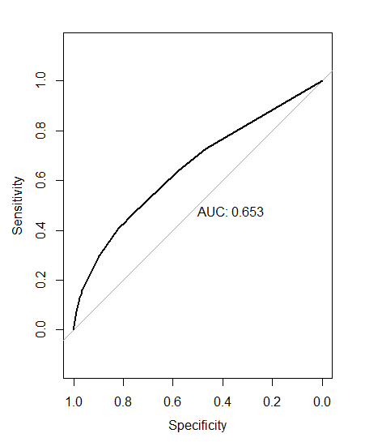
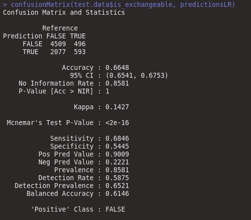
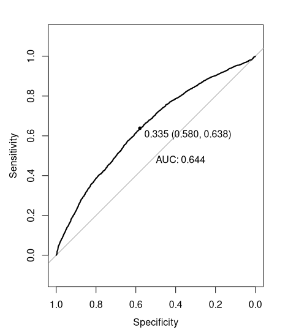

```{r setup, include=FALSE}
knitr::opts_chunk$set(echo = TRUE)
library(tidyverse)
library(hexbin)
library(e1071) #SVM
library(car) #predict
library(caret) #partiiton
library(MASS) #stepwise
library(kernlab) #SVM
library(rpart) # Decision Tree Regression
library(randomForest) #  Random Forest Tree Regression
library(ranger) # RFT more than 53 factors
library(pROC) # Calculate roc
library(vctrs)
```

# Abstract: Description of the project and the findings

The dataset in question is of used cars in a popular catalog from the country of Belarus. This dataset will be cleaned and analyzed to answer several questions about the effect that certain variables have on the price point at which cars are sold at. Ultimately, Multiple Linear Regression Models, SVR, Decision Tree Regression, Random Forest Regression, and KNN will all be used to predict the market price of a used car in Belarus given the attributes found in the dataset. The accuracy of these models were analyzed and performance tested for real-world application with the help of a training and testing dataset. Afterwords, the models were compared to find the most effective model for predicting the price of a used car in Belarus. Also, a Decision Tree and a Logistic Regression Model will be used to create an exploratory and predictive model for the exchangeability of a vehicle in the Belarus.

**STATE OUR FINDINGS**

# Introduction: Overview of the problems/goals and how they will be solved

There are several objectives that will be the focal point of the research done on the used cars dataset. First and foremost, we will be attempted to create a predictive model for the price of a used car given the attributes in the dataset. Since cars are such a big investment we all wondered what affected the price on cars. This is what sparked our initial questions and goals. Solving our proposed questions and goal we hope to gain insights in what affects car prices which would leave us with more knowledge we can use later in life. To solve our questions and answer our goal we are going to use R to make graphs to answer our questions. We will make sure to use different statistical analyses to make sure our graphs are confirmed to be accurate.

# Initial Questions

The main goal is to create a predictive model based on insights gained from analyzing the impact of variables on the selling price of a vehicle. The goal was chosen for its applicability and general interest of which attributes impact price of a used car. Secondly, a model to predict whether a vehicle would be exchangeable or not will be created using a Decision Tree. In addition, there will be several questions that will be answered concerning the dataset. These questions aid in solving the main goal and are important insights to be gleaned from the dataset. The questions that will be answered about the dataset are as follows:

-   What impact does a region have on price?
-   What is the distribution of manufacturers and whether manufacturers have a significant impact on the asking price of a vehicle?
-   What is the relationship between odometer and price?
-   Does the number of photos a vehicle has impact the selling price?
-   Does the number of times a vehicle has been upped in the catalog to raise its position impact the selling price?
-   Relationship between Engine Type and Body Type? What is the impact of Engine Type and Body Type on the selling price?
-   What is the most popular model and whether we can conclude that the popularity of a model has a direct impact on the price of a vehicle?
-   What is the average age of each vehicle manufacturer and whether the manufacturer changes how the production year impacts the selling price?

# Dataset: Source, Description, Cleaning, and other things related to the dataset

## Dataset Source

Kaggle dataset: <https://www.kaggle.com/lepchenkov/usedcarscatalog%22%20/> The dataset that was chosen was obtained from Kaggle and was scraped by an individual named Kirill Lepchenkov with the help of an associate named Vasily Kachalko who aided in parsing the data. This will be utilized to understand the effect certain characteristics have on the price point at which cars in Belarus are sold at. Analyzing cars that are for sale is beneficial in gaining an understanding on what contributes to how a used car would be priced and would allow for predicting the market price of a used car in Belarus.

## Dataset Description

This dataset has 30 attributes with 38,531 samples. Of these attributes there is a mixture of Categorical (Nominal) as well as Numerical (Interval, Ratio) data. The attributes included in the dataset are Manufacturer Name, Model Name, Transmission Type, Color, Odometer Value, Year Produced, Engine Fuel, Engine Has Gas(Boolean), Engine Type, Engine Capacity, Body Type, Has Warranty(Boolean), (State) Condition of the Vehicle, Drivetrain Type, Price in USD, Exchangeability (Boolean), Location Region, Number of Photos, Number of Up Counts, Features {0,1,2,3,4,5,6,7,8,9}, and Duration Listed.

## Data Cleaning

To clean the dataset it was vital to open the csv file and investigate the types of attributes and samples that were given. To get a quick glance of the data we first open the csv file as follows:

```{r ReadCars}
cars <- read_csv("cars.csv")

head(cars, 20)

```

Afterwords, it was crucial to obtain a quick summary of our dataset in order to investigate the steps needed to clean the dataset. This was done with the following line of code:

```{r CarsSummary, fig.height = 15, fig.width = 20 }
summary(cars)
```

From the summary we clearly see that engine_has_gas, has_warranty, and state have very little variability and for that reason they will be removed from the dataset. Furthermore, upon researching the features attribute it was uncovered that the data had severe inconsistencies(according to the creator) and for that reason will be removed. Therefore, we run the select command in order to remove these attributes.

```{r FilterAttributes}
cars_edited <- dplyr::select(cars, -8 & -(12:13) & -(20:29))
head(cars_edited, 20)
```

Now to proceed with cleaning and analyzation we need a more robust knowledge of our dataset. For this reason it is vital to understand the type of data for each attribute. Therefore, we must create a table to organize all our attributes.

+--------+-------------------+---------------------------------------------------------------------------------------------------------------+------------+
| Column | Details           | Value/(Units)                                                                                                 | Data Type  |
+:=======+:=================:+:=============================================================================================================:+===========:+
| A      | Manufacturer Name | Name of vehicle manufacturer                                                                                  | Nominal    |
+--------+-------------------+---------------------------------------------------------------------------------------------------------------+------------+
| B      | Model Name        | Name of vehicle model                                                                                         | Nominal    |
+--------+-------------------+---------------------------------------------------------------------------------------------------------------+------------+
| C      | Transmission      | Type of the transmission                                                                                      | Nominal    |
+--------+-------------------+---------------------------------------------------------------------------------------------------------------+------------+
| D      | Color             | Vehicle body color                                                                                            | Nominal    |
+--------+-------------------+---------------------------------------------------------------------------------------------------------------+------------+
| E      | Odometer Value    | Vehicle odometer value in km                                                                                  | Continuous |
+--------+-------------------+---------------------------------------------------------------------------------------------------------------+------------+
| F      | Year Produced     | The year the car was produced                                                                                 | Continuous |
+--------+-------------------+---------------------------------------------------------------------------------------------------------------+------------+
| G      | Engine Fuel       | Fuel type of the engine                                                                                       | Nominal    |
+--------+-------------------+---------------------------------------------------------------------------------------------------------------+------------+
| I      | Engine Type       | Vehicle engine type                                                                                           | Nominal    |
+--------+-------------------+---------------------------------------------------------------------------------------------------------------+------------+
| J      | Engine Capacity   | The capacity of the engine in liters                                                                          | Nominal    |
+--------+-------------------+---------------------------------------------------------------------------------------------------------------+------------+
| K      | Body Type         | Type of the body (hatchback, sedan, etc.)                                                                     | Nominal    |
+--------+-------------------+---------------------------------------------------------------------------------------------------------------+------------+
| M      | Drivetrain        | Front/rear/all drivetrain                                                                                     | Nominal    |
+--------+-------------------+---------------------------------------------------------------------------------------------------------------+------------+
| N      | Price USD         | Price of a cars as listed in the catalog in USD                                                               | Continuous |
+--------+-------------------+---------------------------------------------------------------------------------------------------------------+------------+
| O      | Exchangeable      | If True the owner of the car is ready to exchange this car to other cars with little or no additional payment | Nominal    |
+--------+-------------------+---------------------------------------------------------------------------------------------------------------+------------+
| P      | Location Region   | The region in Belarus where the car is listed for sale                                                        | Nominal    |
+--------+-------------------+---------------------------------------------------------------------------------------------------------------+------------+
| Q      | Number of Photos  | Number of photos the cas has                                                                                  | Continous  |
+--------+-------------------+---------------------------------------------------------------------------------------------------------------+------------+
| R      | Up Counter        | How many times the sample has been upped in the catalog to raise its position                                 | Continuous |
+--------+-------------------+---------------------------------------------------------------------------------------------------------------+------------+
| S      | Duration Listed   | Number of days the car is listed in the catalog                                                               | Continuous |
+--------+-------------------+---------------------------------------------------------------------------------------------------------------+------------+

From summary we notice that there exists 10 NA's in the attribute engine-capacity. Our understanding of vehicles informs us that engine-capacity is a categorical data-type and as such NA is crucial to our understanding of the data. The NA values serve as a distinguishment for the Electric Vehicles in the data. For the sake of future analyzation it will be useful to replace our NA values with an arbitrary number. We choose to change NA values to -1. Thus we do the following:

```{r HandlingNAValues}
summary(cars_edited$engine_capacity)
cars_edited <- cars_edited %>% mutate(engine_capacity = coalesce(engine_capacity, -1))
summary(cars_edited$engine_capacity)
```

Once the unnecessary attributes were filtered and the NA's were accounted for it important to investigate for duplicate samples. The code for doing this procedure was as follows:

```{r HandlingDuplicateData}
count(cars_edited)
sum(duplicated(cars_edited))
which(duplicated(cars_edited))
cars_edited <- cars_edited %>% distinct()
count(cars_edited)
```

Duplicate entries were identified and removed from the dataset. 41 such duplicate entries existed.

## Dataset Outliers

To determine what to do with the outliers we identified the outliers for each continuous variable and created a separate dataset with no outliers. In order to gauge the impact of our outliers we will have to run our analytics through the dataset with the outliers and the dataset without the outliers.

## Dataset Training and Testing

For the purpose of effectively analyzing the real-world performance of the models that will be used to solve the question we split the dataset into a "Training" dataset and a "Testing dataset. The "Training" set comprised of a random selection of 80% of our dataset and the "Testing" was the rest of the samples not included in the "Training" dataset(20%). The reason for the split was the necessity to be able to access how accurately the models were able to predict the price of a vehicle given a separate portion of samples in the dataset. By testing our models against data not in our training set we can effectively see how well the model holds up with the addition of new vehicles we wish to predict. This was done as following:

```{r TrainingandTestingDataset}
set.seed(123)
training.samples <- cars_edited$manufacturer_name %>% createDataPartition(p = 0.8, list = FALSE)
train.data <- cars_edited[training.samples,]
test.data <- cars_edited[-training.samples,]
```

# Data Analysis and Modeling:

## Visualizations used to analyze data

In an attempt to gain a robust knowledge of our dataset several visualizations were used. Visualization of our data was done in two sections. Initially each attribute was graphed in order to gain a general understanding of how the samples are distributed for each attribute. This was done with the help of Bar Graphs, Histograms, Boxplots, the count function, and pie graphs.

```{r, ManDistrib, fig.height = 12, fig.width = 8}
# 1)What is the distribution of manufacturers?
ggplot(cars_edited, aes(y = manufacturer_name)) + geom_bar(aes(fill = manufacturer_name)) + geom_text(stat='count', aes(label=..count..), hjust=1)
# We can see a large difference in the amount cars for each manufacturers. Volkswagen, Opel, BMW, Audio, AvtoVAZ, Ford, Renault, and Mercedes-Benz are the majot manufacturers.

```

```{r TransmissionDistrib, fig.height = 10, fig.width = 10}
# 2) A table to show unique car model names and quantity
cars_edited %>% count(model_name)

# 3) Plotting the number of cars with automatic or mechanical transmissions
transmissionGrouped <- group_by(cars_edited, transmission)
transmissionCounted <- count(transmissionGrouped)
percentTransmission <- paste0(round(100*transmissionCounted$n/sum(transmissionCounted$n), 2), "%")
pie(transmissionCounted$n, labels = percentTransmission, main = "Transmission Distribution", col = rainbow(nrow(transmissionCounted)))
legend("right", c("Automatic", "Mechanical"), cex = 0.8,
       fill = rainbow(length(transmissionCounted)))
# Mechanical is significantly more common than Automatic. This will definitely be an attribute to consider in our final model
```

```{r Color/Odometer/Year Produced, fig.height = 10, fig.width = 10}
# 4) Plotting cars by color and quantity
ggplot(cars_edited, aes(x = color)) + geom_bar(stat = "count", aes(fill = color)) + geom_text(stat = "count", aes(label = after_stat(count)), vjust = -1)
# There is a lot of diversity in the colors and once again although there are categories with more values there is still a decent amount of variation

# 5) Histogram Odometer Value: Graph to see how the data is skewed
ggplot(cars_edited, aes(odometer_value)) + geom_histogram()
# The data is left-skewed with what appears to be outliers as around 1,000,000 miles

# 6) Histogram Year produced: Graph to see how the data is skewed
ggplot(cars_edited) + geom_histogram(aes(year_produced))
# The graph seems to almost be normally distributed minus what appears to be some outliers on the the older end of the years
```

```{r FuelDistrib, fig.height = 10, fig.width = 10}
# 7) Graph to show what fuel distribution
ggplot(cars_edited, aes(x = engine_fuel)) + geom_bar(stat = "count", aes(fill = engine_fuel)) + geom_text(stat = "count", aes(label = after_stat(count)), vjust = -1)
# There are only 2 major engine fuels(gasoline and diesel)
```

```{r EngineDistrib/Capacity/Body Type/Drivetrain/Price/ExchangebilityDistrib , fig.height = 10, fig.width = 10}
# 8) Pie graph to show engine type Distribution (Electric, Diesel, Gasoline)
TypeGrouped <- group_by(cars_edited, engine_type)
TypeCounted <- count(TypeGrouped) 
percentType <- paste0(round(100*TypeCounted$n/sum(TypeCounted$n), 2), "%")
pie(TypeCounted$n, labels = percentType, main = "Engine Type Distribution", col = rainbow(nrow(TypeCounted)))
legend("right", c("diesel", "electric", "gasoline"), cex = 0.8,
       fill = rainbow(nrow(TypeCounted)))
# Not surprisingly gasoline and diesel are the 2 most common Engine Type considering the fuel distribution

# 9) Table for Engine capacity
cars_edited %>% count(engine_capacity)
# Engine Capacity seems to be left-skewed which may indicate outliers

# 10) Bar graph Body type: count how many cars have the same body type
ggplot(cars_edited, aes(x = body_type), stat = "count") + geom_bar() + geom_text(stat = "count", aes(label = after_stat(count)), vjust = -1)
# There is some diversity in body type and the diversity in categories may lend itself to useful data for a future model

# 11) Graph Drivetrain distribution:
drivetrainGrouped <- group_by(cars_edited, drivetrain)
drivetrainCounted <- count(drivetrainGrouped) 
percentdrivetrain <- paste0(round(100*drivetrainCounted$n/sum(drivetrainCounted$n), 2), "%")
pie(drivetrainCounted$n, labels = percentdrivetrain, main = "Drivetrain Distribution", col = rainbow(nrow(drivetrainCounted)))
legend("right", c("all", "front", "rear"), cex = 0.8,
       fill = rainbow(nrow(drivetrainCounted)))
# Although most vehicles are front wheel drive there is enough all and real wheel drive to gather some promising insights 

# 12) Number of cars with same price
ggplot(cars_edited, aes(x = price_usd), stat = "count") + geom_histogram()
# This graph is extremely left-skewed. The sheer usefulness of price in our dataset will make this our main response attribute.

# 13) Pie Graph exchangeability Distribution
exchangeableGrouped <- group_by(cars_edited, is_exchangeable)
exchangeableCounted <- count(exchangeableGrouped) 
percentexchangeable <- paste0(round(100*exchangeableCounted$n/sum(exchangeableCounted$n), 2), "%")
pie(exchangeableCounted$n, labels = percentexchangeable, main = "Exchangeability Distribution", col = rainbow(nrow(exchangeableCounted)))
legend("right", c("False", "True"), cex = 0.8,
       fill = rainbow(nrow(exchangeableCounted)))
# Exchangeability is more common than anticipated. It will be interesting to see if pricier or cheaper cars consent to exchanges

```

```{r RegionDistrib, fig.height = 10, fig.width = 10}
# 14) Pie Graph Location region: Count the number of cars in a region
regionPriceDF <- group_by(cars_edited, location_region)
regionPriceDFCount <- count(regionPriceDF)
percentRegion <- paste0(round(100*regionPriceDFCount$n/sum(regionPriceDFCount$n), 2), "%")
pie(regionPriceDFCount$n, labels = percentRegion, main = "Region Price Distribution", col = rainbow(nrow(regionPriceDFCount)))
legend("right", c("Brest Region", "Gomel Region", "Grodno Region", "Minsk Region", "Mogilev Region", "Vitebsk Region"), cex = 0.8,
       fill = rainbow(nrow(regionPriceDFCount)))
# Minsk accounts for a very large amount of vehicles(makes sense considering the population sizes) with even distributions everywhere else. 
# The usefulness of the attribute may be less since Minsk is such a large portion of the data.
```

```{r NumPhotos/UpCounter/Duration, fig.height = 10, fig.width = 10}
# 15) Histogram Number of photos: Graph to see how the data is skewed
ggplot(cars_edited) + geom_histogram(mapping = aes(number_of_photos))
# Graph is very left-skewed. I suspect photos may increase the value of a vehicle, but tests will need to be done on this

# 16) Box plot Number of photos: Graph to see how the data is skewed
ggplot(cars_edited) + geom_boxplot(mapping = aes(number_of_photos))
# There are many outliers. With extra time we may be able to investigate the impact of these outliers on the data.

# 17) Histogram Up counter: investigating how our outliers look with our modifications
ggplot(cars_edited) + geom_histogram(mapping = aes(up_counter))
# Clearly an outliers exists since there is a large scale. 

# 18) Box plot Duration listed: investigating how our outliers look with our modifications
ggplot(cars_edited) + geom_boxplot(mapping = aes(duration_listed))
# There is a significant amount of outliers. There is no evidence to conclude these should be eliminated.

# 19) Histogram Duration listed: Graph to see how the data is skewed
ggplot(cars_edited) + geom_histogram(aes(duration_listed))
```

Once a general understanding of each attribute was gained we began to visualize various combinations of attributions. These visualizations were vital in seeing different relationships among our samples. The visualizations that were used were Balloon Plot, Scatterplot, frequency polygons, dplyr::summarize, and Boxplots.

```{r ManufByRegion, fig.height = 10, fig.width = 10}
# 1) Graph to show the amount of cars(by manufacturer name) in a region BALLOON PLOT
ggplot(cars_edited, aes(location_region, manufacturer_name)) + geom_count()
# Due to the quantity of categories a test will need to be done to gather significant data
```

```{r CarsByYear/CarsByColor/PriceByYearAndType/BodyTypeAndPrice, fig.height = 10, fig.width = 10}
# 2) Graph to show the price of a car according to its year produced SCATTER PLOT
ggplot(cars_edited, aes(year_produced, price_usd)) + geom_point() + geom_smooth()
# There exists a parabolic relationship between year_produced and price_usd

# 3) Graph to show the number of cars in specific colors(10 red cars, 8 blue cars etc.) by region BAR GRAPH
ggplot(cars_edited, aes(color)) + geom_bar(aes(fill = location_region))
# From looking at the bar graph there does not seem to be any significant differences in color distribution for locations

# 4) Graph to show the price of a car according to it's millage(odometer) SCATTER PLOT
ggplot(cars_edited, aes(odometer_value, price_usd)) + geom_point(aes(color = is_exchangeable)) + geom_smooth()
# This graph is incredible diverse and indicates that there is a need for advanced models to access price relationships.

# 5)Graph to show the price of a car according to it's year produced AND body type SCATTER PLOT
ggplot(cars_edited, aes(year_produced, price_usd)) + geom_point(aes(color = body_type)) + geom_smooth()
# There seems to be a parabolic relationship between year_produced and price_usd

# 6) Group by car body type and get it's mean price
group_by(cars_edited, body_type) %>% summarise(price_mean = mean(price_usd))

# 7) Graph to show the outliers with body type and price BOX PLOT
ggplot(cars_edited) + geom_boxplot(mapping = aes(x = reorder(body_type, price_usd), y =
                                                   price_usd))
```

```{r BodyTypePriceAndEngineFuel/PriceByPhotos/ManufByMeanPrice, fig.height = 10, fig.width = 10}
# 8) Graph to show the correlation between car body type, price, AND engine fuel
ggplot(cars_edited) + geom_point(mapping = aes(x = body_type, y = price_usd, color = engine_fuel))

# 9) Graph to show the price of a car according to it's number of photos incl. engine fuel SCATTER PLOT
ggplot(cars_edited) + geom_point(mapping = aes(x = number_of_photos, y = price_usd, color = engine_fuel))

# 10) Group cars by manufacturer, and get it's mean price
cars_edited %>% group_by(manufacturer_name) %>% summarize(mean(price_usd))
```

**To find an optimal model to predict whether a vehicle is exchangeable we utilized both a Decision Tree and Logistic Regression.**

Logistic Regression: This is a very popular and powerful classification technique. Since we are dealing with a binary response variable the logistic regression is an optimal model to use.

Decision Tree: Although the logistic regression model is extremely powerful we will still run the Decision Tree in an attempt to create a more accurate model. Due to the robust and simple nature of the decision tree it was important to use this model to predict exchangeability. This model should be able to handle any outliers in our data and provide an effective predictive model.

**Several machine learning techniques were used in an attempt to create the most accurate prediction model for our main goal. The models used in the project were as follows:**

Multiple Linear Regression: This was used for the sake of gauging the impact of the continuous attributes on the price of the vehicle. This model is simple to understand and involves less computing power than more advance models which led to our decision to utilize this ML method as our first model.

SVR: Used to see if there is a model that can handle every attribute and adjust the model according to its impact on price. Although this model involves much more computing power we believed that the robust nature of this model lends itself to a high level of accuracy. This models effectiveness with categorical data, and ability to work with both linear and non-linear boundaries makes it a prime model for our dataset. Furthermore, in order to optimize our SVR model we will use linear, polynomial, and radial kernel transformations and compare the results from the models that we generate.

Decision Tree (Partition): Used for predictive modeling. Since it is incredibly robust and relies on very few assumptions we believed it would be able to handle possible outliers in our data and work around the size of our dataset to produce an optimal model. Its simpler nature also makes it a model that would be preferred over other models(such as Random Forest Regression or KNN).

Random Forest Regression: Albeit, Random Forest Regression is more complicated than a Decision Tree since it leverages multiple decision trees it is still a crucial model for our dataset. The reason for using this model is for the sake of seeing if we can create an even more accurate model. If we find the accuracy is marginally better it may be preferred to use a Decision Tree since its easier to compute. Nevertheless, the Random Forest Regression is a wonderful tool in creating a predictive model and worth testing out for the sake of optimization.

KNN:K Nearest Neighbor was chosen due to its popularity and simplicity. KNN is able to handle our Categorical as well as Continuous attributes and for that reason it is a good model to be used to predict price. It will be vital to compare this model with the other models to investigate how useful of a model it is for our dataset.

# Final outcomes and Analysis

## Questions and Answer Justifications

#### **Q1:** What impact does a region have on price?

**A: Although the region does impact price the extent of this impact would have to be assessed in a model that includes more attributes. The reason for this is because correlation does not necessitate causation. In other words, more attributes may be at play and to get a better understanding of the impact of region on price it will be vital to access the role region has in the overall models.**

**Justification:**

To answer this question we decided to use a bar chart in order to see the average prices per region in comparison with each other.

```{r regionPrice, fig.height = 8, fig.width = 10, echo=FALSE}
#Aggregating the data of price to region to get the mean of prices
#per region
regionPriceDF <- group_by(cars_edited, location_region)
regionPriceDF_averages <- summarise(regionPriceDF, average_price_usd = mean(price_usd))
ggplot(regionPriceDF_averages,aes(x= location_region, y = average_price_usd)) + geom_bar(stat = "identity") 
```

Looking at the graph we can predict that region may play a part in price. We derive this prediction from the observation that although most regions have similar vehicle price averages Minsk has a significantly higher average. However, we can't conclude that with just this graph, we need to confirm this by an appropriate test. The test used to see if region did in fact have a significant impact of price was the One-Way Anova Test. Anova was used because the region attribute consists of several categories and we wished to see its impact on a single continuous variable.

Prior to doing the One-Way Anova test we first performed some data transformation to gain a better understanding of the differences between the region prices.

```{r SummarizeRegion}
group_by(regionPriceDF, regionPriceDF$location_region) %>%
  summarise(
    count = n(),
    mean = mean(price_usd, na.rm = TRUE),
    sd = sd(price_usd, na.rm = TRUE)
  )
```

Once again quick inspection tells us that Minsk has a significantly different price and a much larger count. To affirm our suspicions from the graph and summarize we now perform the Anova test.

The hypotheses for the test are as follows:

H~0~ = The means of the different groups are the same

H~a~ = At least one sample mean is not equal to the others

Furthermore, we will use 0.05 as our significance level. The result of the anova test was the following:

```{r AnovaRegion}
# Compute the analysis of variance
res.aov <- aov(regionPriceDF$price_usd ~ regionPriceDF$location_region,
               data = regionPriceDF)
# Summary of the analysis
summary(res.aov)
```

Looking at the results of the one-way anova we can confirm our prediction. The p-value was less than 0.05(\<2e-16) and so we conclude that there are significant differences between the regions.

We continue our investigation of the problem at hand by using Tukey HSD to do multiple pairwise-comparisons between the means of our groups.

```{r RegionTukeyTest}
# Tukey Test
TukeyHSD(res.aov)
```

**Analyzing the results we can conclude that the differences in average price between Minsk and every other region is statistically significant. The data set region does have an impact on vehicle price.**

------------------------------------------------------------------------

#### **Q2:** What is the distribution of manufacturers and whether manufacturers have a significant impact on the asking price of a vehicle?

**A: We can confirm that there is a relationship between the manufacturer and asking price. The relationship seems to be one of the larger factor for asking price, but is not significant enough to predict price on its own.**

**Justification:**

Two bar graphs were used in solving this question. First a bar graph was used to plot the distribution of vehicles for each manufacturer. Then another bar graph was used as a means of quickly inspecting how average price ranged between different manufacturers. As useful as these graph were in understanding the relationship between price and manufacturer it proved to be insufficient in proving a result. In order to prove that there existed a significant relationship between manufacturer and asking price of a car One-Way Anova was utilized. Once again were were dealing with a categorical data with several categories which lends the problem nicely to this sort of test.

First a bar graph was used to effectively plot the distribution of vehicles for each manufacturer.

```{r manufacturerVsCount, fig.height = 9, fig.width = 12}
# 1)What is the distribution of manufacturers?
ggplot(cars_edited, aes(y = manufacturer_name)) + geom_bar(aes(fill = manufacturer_name)) + geom_text(stat='count', aes(label=..count..), hjust=1)
```

Once the distribution of the Manufacturers was plotted we turned our attention onto the second part of the question: Whether manufacturers have a significant impact on the asking price of a vehicle?

Another bar graph was used as a means of quickly inspecting how average price ranged between different manufacturers.

```{r manufacturerVsPrice, fig.height = 9, fig.width = 12}
manuPriceDF <- group_by(cars_edited, manufacturer_name)
manuPriceDF_averages <- summarise(manuPriceDF, average_price_usd = mean(price_usd))
ggplot(manuPriceDF_averages, aes(x = average_price_usd, y = manufacturer_name)) + geom_bar(aes(fill = manufacturer_name),stat="identity") + geom_text(aes(label =  paste0("$",round(average_price_usd)), hjust = 1))
```

Looking at the bar graph we can predict that the manufacturer of a vehicle has an impact on asking price. Nevertheless, observation is not sufficient evidence and so we proceed by testing this claim. Once again we are dealing with categorical data and we wish to compare the means of the prices for the Manufacturers. Naturally we chose the One-Way Anova test to test our claim.

The hypotheses for the test are as follows:

H~0~ = The mean prices of the different groups are the same

H~a~ = At least one sample mean price is not equal to the others

Furthermore, we will use 0.05 as our significance level. The result of the anova test was the following:

```{r ManufSummaryAndAnova}
manuSumm <- group_by(manuPriceDF, manuPriceDF$manufacturer_name) %>%
  summarise(
    count = n(),
    mean = mean(price_usd, na.rm = TRUE),
    sd = sd(price_usd, na.rm = TRUE)
  )

# Compute the analysis of variance
res.aovTwo <- aov(manuPriceDF$price_usd ~ manuPriceDF$manufacturer_name,
                  data = manuPriceDF)

summary(res.aovTwo)
```

Investigating the results of the one-way anova we can confirm our claim. The p-value was less than 0.05(\<2e-16) and so we conclude that there are significant differences between the manufacturers.

We continue with the Tukey HSD to do multiple pairwise-comparisons between the means of our groups. This will allow us to see exactly which manufacturers significantly differ in asking price.

```{r ManufTukey, eval=FALSE, include=TRUE}
# Result ommitted for brevity sake}
# Tukey Test
TukeyHSD(res.aovTwo)
```

With the results see that numerous manufacturers are statistically different and we can use this data to list every statistically different manufacturer.

**We can confirm that there is a relationship between the manufacturer and asking price.**

------------------------------------------------------------------------

#### **Q3:** What is the relationship between odometer and price?

**A: There is a low negative correlation between price and odometer.**

**Justification:**

Initially a Scatter plot was used to quickly inspect for possible relationships between price and odometer.

```{r OdometerPrice, echo=FALSE}
ggplot (cars_edited, aes( x =odometer_value, y=price_usd)) + geom_point() + stat_smooth()
```

When we investigate this graph we initially notice that the line of best fit seems to be going down as the odometer value increases. Nevertheless, the data had a significant amount of variation and further testing would need to be done to confirm our results.

Since we are investigating the relationship between 2 continuous variables we begin by using a correlation test.

The hypotheses for the test are as follows:

H~0~ =There does not exist a correlation between Odometer Value and Vehicle Price

H~a~ = There does exist a correlation between Odometer Value and Vehicle Price

Furthermore, we will use 0.05 as our significance level. The result of the correlation test was the following:

```{r OdometerPriceCor}
#Getting cor value
cor.test(cars_edited$odometer_value, cars_edited$price_usd)
```

Since the p-value is less than 0.05 we can conclude that Price and Odometer are significantly correlated with a correlation coefficient of -0.4201039 and p-value of \< 2.2e-16

We continue with our question by investigating how good of an indicator of price odometer is. To do this we will use linear regression, and check the percentage of accuracy of that line. Afterwords, we will graph the linear regression line to provide us with a useful visual.

```{r odometerLm, echo=FALSE}
odometer_on_price <- lm (price_usd ~ odometer_value, data = cars_edited)

ggplot (cars_edited, aes(x=odometer_value, y=price_usd)) + geom_point() + stat_smooth(method=lm)
```

Once the linear regression model is created and graphed we proceed to check the R2 to see the proportion of the prices that can be explained by the model, the variability of the beta coefficients, and the percentage error.

```{r OdometerPriceAccuracy}
summary(odometer_on_price)
confint(odometer_on_price)
#                       2.5 %        97.5 %
#(Intercept)     1.145654e+04  1.169971e+04
#odometer_value -2.028451e-02 -1.942748e-02

sigma(odometer_on_price)*100/mean(cars_edited$price_usd)
#[1] 87.89188
```

The R2 is 0.1765 which indicates that a low proportion of prices in the data can be explained by the model. Furthermore, the percentage error is 87.89188 which confirms how poor a model would be if it solely used odometer to predict price.

**We can conclude that the higher the odometer the lower the price of the vehicle will be.** Nevertheless, our linear regression model informs us that in order to create an accurate model we will need to consider more attributes.

------------------------------------------------------------------------

#### **Q4:** Does the number of photos a vehicle has impact the selling price?

**A: There exists a low positive correlation between number of photos a vehicle has and the selling price.**

**Justification:**

In order to gain an intuitive understanding of the question we sought to use a scatter plot to see the relationship between price and number of photos.

```{r NumPhotosPrice, fig.height = 10, fig.width = 10}
#Scatter plot: Number of photos and price
ggplot(cars_edited, aes( x =number_of_photos, y=price_usd)) + geom_hex() + stat_smooth(color = "red") 
```

When we look at this graph we can see that although there exists a line. Nevertheless, the data had a significant amount of variation and further testing would need to be done to get a result. It does seem that there will be a very little(if any) correlation between price and number of photos.

Since we are investigating the relationship between 2 continuous variables we will be using the correlation test.

The hypotheses are as follows:

H~0~ =There does not exist a correlation between Number of Photos and Vehicle Price

H~a~ = There does exist a correlation between Number of Photos and Vehicle Price

We will use 0.05 as our significance level. The result of the correlation test was the following:

```{r NumPhotosPriceCor}
#getting the cor value
cor.test(cars_edited$number_of_photos, cars_edited$price_usd)
```

Since the p-value is less than 0.05 we can conclude that Price and Number of Photos are significantly correlated with a correlation coefficient of 0.3161726 and p-value of \< 2.2e-16

Next we aim to investigate how good of an indicator of price the number of vehicle photos is. We shall employ linear regression, check the percentage of accuracy of that line, and graph the linear regression line to provide us with a useful visual.

```{r NumPhotosPriceLMandPlot, fig.height = 10, fig.width = 10}
#Getting the formula for linear regression
number_of_photos_on_price <- lm (price_usd ~ number_of_photos, data = cars_edited)

#Scatter plot: Number of photos and price with linear regression line
ggplot (cars_edited, aes(x=number_of_photos, y=price_usd)) + geom_point() + stat_smooth(method=lm)
```

Although the linear regression model is created and graphed there remains information and insights to be gleaned. We proceed to check the R2 to see the proportion of the prices that can be explained by the model, the variability of the beta coefficients, and the percentage error.

```{r NumPhotosPriceAccuracy}
summary(number_of_photos_on_price)

# R^2 is very low(0.09994) which tells us that number of photos is not a good indicator of price. 
# We can suspect that several more variables are in play.

confint(number_of_photos_on_price)
#                    2.5 %    97.5 %
#(Intercept)      3304.283 3532.2680
#number_of_photos  323.305  343.2882
sigma(number_of_photos_on_price)*100/mean(cars_edited$price_usd)
# Our prediction error rate is extremely high (91.82279%) which explains the low correlation
```

The R2 is 0.09994 which indicates that a low proportion of prices in the data can be explained by the model. In other words, number of photos is not a good indicator of price(more attributes are needed in a model). Also, the percentage error is 91.88472 which is very high. This confirms how poor a model would be if it solely used number of photos to predict price.

**We can conclude there is a low negative correlation between price and odometer.** Our linear regression model tells us that to create an accurate model we will need to consider more attributes.

------------------------------------------------------------------------

#### **Q5:** Does the number of times a vehicle has been upped in the catalog to raise its position impact the selling price?

**A:** **The number of times a vehicle has been upped has a negligible impact on the selling price.**

**Justification:**

Graphs used: Scatter plot How these graphs helped us solve the problem: Using a scatter plot for this question again allowed us to see the relationship between the two variables. With that we can come up with a solution to the question.

To begin answering this questions it was natural to use scatterplot (using 2 continuous attributes) to gain an intuitive understanding of any possible relationship.

```{r upCounterPlot, fig.height = 10, fig.width = 10}
#Regression analysis
ggplot(cars_edited, aes( x =up_counter, y=price_usd)) + geom_hex() + stat_smooth(color = "red")
```

Looking at the Scatterplot we see a possible positive correlation although the variability of the data makes it hard for us to affirm this prediction. To continue we will use the correlation test(since we are dealing with continuous attributes) to check for a correlation between number of up counts and price of a vehicle.

The hypotheses for the correlation test are the following:

H~0~ =There does not exist a correlation between number of up counts and vehicle price

H~a~ = There does exist a correlation between number of up counts and vehicle price

We will use 0.05 as our significance level. The results are the following:

```{r upCountCor}
#Correlation
cor.test(cars_edited$up_counter, cars_edited$price_usd)
```

Since the p-value is less than 0.05 we can conclude that Price and number of up counts are correlated with a correlation coefficient of 0.05777007 and p-value of \< 2.2e-16.

However, although they are correlated we do see that the correlation coefficient is very close to 0. Meaning that the correlation is almost entirely negligible. If one were to attempt to use this as a predictor of price the results would be poor.

Nevertheless,we will use linear regression to see how poor of an indicator number of up counts really is. We will check the percentage of accuracy of the linear regression line, and graph the linear regression line to provide useful insights.

```{r UpCounterLM/Accuracy/Plot, fig.height = 10, fig.width = 10}
# Create LM
up_counter_on_price <- lm (price_usd ~ up_counter, data = cars_edited)
#Finding how well this line fits the data
summary(up_counter_on_price)

# R^2 is extremely low which affirms that number of photos is not a good indicator of price. 

confint(up_counter_on_price)
sigma(up_counter_on_price)*100/mean(cars_edited$price_usd)

# Our prediction error rate is extremely high (96.65168%) which confirms to us that up_counter is a terrible predictor of price(as we can see by the correlation test)

#Scatter plot: up counter and price with regression line
ggplot (cars_edited, aes(x=up_counter, y=price_usd)) + geom_point() + stat_smooth(method=lm)
```

The R2 is 0.003311 which indicates that a low proportion of prices in the data can be explained by the model. In other words, number of up counts is a very poor indicator of price(we need more attributes in the model). Also, the percentage error is 96.69137 which is ludicrously high. This confirms how poor a model would be if it solely used number of up counts to predict price.

**We can conclude there is a negligible positive correlation between price and number of up counts.**

------------------------------------------------------------------------

#### **Q6:** Relationship between Engine Type and Body Type? What is the impact of Engine Type and Body Type on the selling price?

**A: Sedan and Gasoline is the most common followed by Gasoline and Hatchback. Engine Type and Body Type do have an impact on the selling price, but the extend of this impact will need to be investigated in our overall model.**

**Justification**:

To begin this question it was important to have a working knowledge of how body type and engine type related to one another. Initially a Mosaic plot felt like the right graph to show relationships, but the quantity of categories made a balloon plot much easy to read. The spacious nature of the balloon plot greatly aided in gaining insights from the data and pushed further investigation.

```{r EngBodyBalloonPlot, fig.height = 10, fig.width = 10}
# Balloon Plot
ggplot(cars_edited, aes(body_type, engine_type)) + geom_count()
```

Based on this Balloon plot we can see that several combinations of body types and engine types do not exist. Furthermore, there seems to be higher quantities of hatchbacks with gasoline engines and sedans with gasoline engines. Nevertheless, visualization does not suffice in proving any relationship. We shall proceed with a Chi-Square test for more information. The reason for a Chi-Square test is that we are attempting to analyze the frequency table of two categorical variables(engine type and body type).

The hypotheses for the Chi-Square test are as follows:

H~0~ = Engine Type and Body Type are independent

H~a~ = Engine Type and Body Type are dependent

The test will be performed with 0.05 as our significance level. The results are the following:

```{r EngineBodyChiSquare}
#Chi-Square Test
engine_body.data <- table(cars_edited$body_type, cars_edited$engine_type)
chisq.test(engine_body.data)
```

The result of the Chi-Square Test tells us that Engine Type and Body Type are dependent.

We continue with a proportion table to give us an easy way of seeing the distribution of engine type and body type.

```{r EngineBodyPropTable}
# Table
prop.table(engine_body.data)*100
```

From the table we can clearly see that Hatchback and Gasoline as well as Sedan and Gasoline are the most common combinations of the two variables as we suspected from the balloon plot.

We continue by attempting to solve that second part of the question. That is, what is the impact of Engine Type and Body Type on the selling price?

The most effective method of solving this question is with the use of the Two-Way Anova. The reason for the use of this test is because we are attempting to evaluate the simultaneous effect of two grouping variables(engine and body type) on a response variable(price).

The hypotheses for the Two-Way Anova test are:

H~o~ = 1. There is no difference in the means of Engine Type 2. There is no difference in the means of Body Type. 3. There is no interaction between engine and body type

Ha = For cases 1 and 2 the means are not equal and for case 3 there is an interaction between Engine and Body Type.

```{r EngineBodyAnova}
body_engine_type_on_price.aov <- aov(price_usd ~ engine_type * body_type, data = cars_edited)
summary(body_engine_type_on_price.aov)
```

Since the p-value is less than 0.05 for all three cases we can confirm that there is a difference in the means of Engine Type, the means of Body Type, and there is an interaction between Engine and Body Type.

To conclude our investigation we will run the Tukey Honest Significant Differences in order to perform the multiple pairwise-comparisons between the means of groups to determine which groups are different and how they differ.

```{r EngineBodyTukey, eval=FALSE, include=TRUE}
# Result ommitted for brevity sake}
#Tukey HSD
TukeyHSD(body_engine_type_on_price.aov)
## Fit: aov(formula = price_usd ~ engine_type * body_type, data = cars_edited)
## 
## $engine_type
##                         diff        lwr       upr p adj
## electric-diesel    10052.532   5867.612 14237.452 1e-07
## gasoline-diesel    -1175.359  -1318.298 -1032.420 0e+00
## gasoline-electric -11227.891 -15412.002 -7043.779 0e+00
```

The Tukey Test results can be evaluated to gain more detailed information on the relationship between price and Engine/Body Type.

**These tests confirm our that Engine Type and Body Type significantly impact the selling price of a vehicle.**

------------------------------------------------------------------------

#### **Q7:** What is the most popular model and whether we can conclude that the popularity of a model has a direct impact on the price of a vehicle?

**A**: **The most popular is the Passat. Furthermore, The popularity of a vehicle does seem to have an impact on the average_price of a vehicle. However, more attributes would be needed to predict price.**

**Justification:**

The nature of the first part of the question informs us that we can figure out the most popular model without a graph. To find the most popular model we performed a count on every model and printed out the result.

```{r ModelCount, fig.height = 10, fig.width = 10}
# Finding out model popularity
models_counted <- cars_edited %>% count(model_name)
models_counted %>% arrange(desc(n))
```

**From the table it is clear that the most popular model is the Passat.**

Now we go on to solve the next part of the question: Whether we can conclude that the popularity of a model has a direct impact on the price of a vehicle?

Since we are using a categorical factor and attempting to find its impact on a continuous response variable we will deploy the One-Way Anova Test.

The hypotheses for the One-Way Anova test are:

H~o~ = The means of the different models are the same

H~a~ = At least one sample mean is not equal to the others.

Also, the level of significance to be used with this test is 0.05.

We proceed by running the following code:

```{r ModelAnova}
# Do an anova test to see if model name significantly impacts price of a vehicle
model_price <- aov(price_usd ~ model_name, data = cars_edited)
summary(model_price)
```

Since the p-value is less than 0.05 we can conclude that the model name does have a significant impact on the price of a vehicle.

We continue our investigation by attempting to see how effective model name is in predicting the price of a vehicle. In order to do this we will use a Simple Linear Regression model as follows:

```{r modelPriceRegression}
#Taking the linear regression
modelPrice <- lm (price_usd ~ model_name, data = cars_edited)
```

```{r modelPriceSummary, eval=FALSE, include=TRUE}
# Result ommitted for brevity sake
# Making sure the linear regression line matches the model
summary(modelPrice)
## Residual standard error: 4043 on 37372 degrees of freedom
## Multiple R-squared:  0.6154, Adjusted R-squared:  0.6039 
## F-statistic: 53.54 on 1117 and 37372 DF,  p-value: < 2.2e-16
```

The R2 is 0.6039 which indicates that a relatively large proportion of prices in the data can be explained by the model. Although more attributes will aid in predicting prices we can confirm that there is significant usefulness in using the model name attribute in our future models.

We continue by assessing the error of our model to get a better picture of the models accuracy.

```{r ModelConf, eval=FALSE, include=TRUE}
# Result ommitted for brevity sake
confint(modelPrice)
```

```{r ModelError}
sigma(modelPrice)*100/mean(cars_edited$price_usd)
```

Our prediction error rate is lower than for other attributes (60.95455%) which confirms to us that model name is a better predictor of price. Nevertheless, a prediction error of 60.95455% tells us that for prediction we will need more attributes.

**This analysis concludes that the popularity of a vehicle does seem to have an impact on the average_price of a vehicle. However, more attributes would be needed to predict price.**

------------------------------------------------------------------------

#### **Q8:** What is the average age of each vehicle manufacturer and whether the manufacturer changes how the production year impacts the price?

**A: The average age of each manufacturer can be found using some data transformation. Furthermore, the manufacturer does influence how production year changes the price of a vehicle.**

**Justification:**

Prior to working on this question it would be useful to have some sort of visual understanding of our data. To accomplish this we will use a scatter plat with facet wrap to show the distribution of years for each manufacturer.

```{r ScatterPlotFacetHex, fig.height = 10, fig.width = 20}
#Scatter plot: Year produced by price and colored by manufacturer name
ggplot(cars_edited, aes(x = year_produced, y = price_usd)) + geom_hex() + facet_wrap(~ manufacturer_name)
```

Upon looking at the graph it is clear that visualization is not the way to solve this question. Nevertheless, the graphs seem to follow a similar pattern; more newer cars exist and they are more expensive.

To solve for the average age of each manufacturer we will perform a data transformation as follows:

```{r ManufYearsSummary}
#Group cars by manufacturer name
manufacturer_year <- group_by(cars_edited, manufacturer_name)

#Summarize the manufacturer years average
manufacturer_year_averages <- summarise(manufacturer_year, average = mean(year_produced, na.rm = TRUE))
# 1) Average age of each vehicle manufacturer
manufacturer_year_averages %>% arrange(desc(average))
```

Observing the results of the summary it is clear that the manufacturers with the newest car averages are Lifan, Buick, Geely, and LADA.

Next we continue with the second part of the question: Whether the manufacturer changes how the production year impacts the price?

To solve this question we will be using the Two-Way Anova. The Two-Way Anova is used because we are attempting to evaluate the simultaneous effect of Manufacturer and Year Produced on price.

The hypotheses for the Two-Way Anova test are:

H~o~ = 1. There is no difference in the means of Manufacturer. There is no difference in the means of Year Produced. 3. There is no interaction between Manufacturer and Year Produced

Ha = For cases 1 and 2 the means are not equal and for case 3 there is an interaction between Manufacturer and Year Produced.

For this test we will be using 0.05 as our level of significance. The results are thus:

```{r ManufYearAnova}
# Do an anova test to see if year produced significantly impacts price of a vehicle
manufacturer_price <- aov(price_usd ~ manufacturer_name * year_produced, data = cars_edited)
summary(manufacturer_price)
```

In our results we can see that the p-value \< 0.05 for each of our 3 cases. In other words, there is a difference in the means of Manufacturer, the means of Year Produced, and there is an interaction between Manufacturer and Year Produced. **The manufacturer does change how the production year affects the selling price.**

Now that we know that Manufacturer and Year Produced impact the price of our vehicle it important to see how well of a model we can produce given these two attributes. To do this we will use the Multiple Linear Regression Model.

```{r ManufYearLM}
#Taking the linear regression
ManufyearPrice <- lm (price_usd ~ manufacturer_name + year_produced, data = cars_edited)

#Making sure the linear regression line matches the model
summary(ManufyearPrice)
```

The R2 is 0.6152 which indicates that a relatively large proportion of prices in the data can be explained by the model. Although more attributes will aid in predicting prices we can confirm that there is significant usefulness in using Manufacturer and Year Produced in our future models.

To continue our investigation we assess the prediction rate as follows:

```{r ManufYearLMAccuracy}
confint(ManufyearPrice)
sigma(ManufyearPrice)*100/mean(cars_edited$price_usd)
```

Our prediction error rate is lower than for other attributes (60.12396%) which confirms to us that year produced and Manufacturer are decent predictors of price. A prediction error of 60.12396% tells us that for prediction we will need more attributes than just year produced and Manufacturer. **We conclude that Manufacturer and Year Produced do impact price and that the manufacturer does change how the production year affects the selling price.**

## Predicting Exchangeability

#### Predicting Exchangeability using a Decision Tree

In an attempt to predict exchangeability we will deploy a Decision tree. The model will be running the train function with 10-fold cross-validation and a tune-length of 10(number of cp values to evaluate)l. These settings should prune our tree and ensured an optimal decision tree to predict exchangeability.

```{r DTRegressionExchangeability, eval=FALSE, include=TRUE}
### DT Regression
model_DT_Train <- train(is_exchangeable ~ ., data = train.data, method = "rpart",
                        trControl = trainControl("cv",number = 10),
                        preProcess = c("center","scale"),
                        tuneLength = 10)

predictionDT <- predict(model_DT_Train, test.data)

# Check accuracy, error, and confusion matrix
accuracy <- mean(test.data$is_exchangeable == predictionDT)
accuracy
# [1] 0.6871661
error <- mean(test.data$is_exchangeable != predictionDT)
error
# [1] 0.3128339
confusionMatrix(test.data$is_exchangeable, predictionDT)
```

The accuracy above tells us that the Decision Tree correctly predicted \~69% of the individuals who agreed to exchangeing their vehicles. This is better than random guessing. The misclassification error rate is \~31%.


Sensitivity is \~70%, that is the proportion of individuals who were correctly identified to being willing to take part in an exchangement for their vehicle.

The specificity of the model is around 61% which is the proportion of individuals who were correctly identified to not being willing to take part in an exchangement for their vehicle.

The model precision or proportion of positive predicted value is \~ 90%

```{r DTRegressionExchangeabilityRoc, eval=FALSE, include=TRUE}
#Compute roc
predictionsDTProb <- predict(model_DT_Exchangeable, test.data, type = "prob")
res.roc <- roc(test.data$is_exchangeable ~ predictionsDTProb[,2])
plot.roc(res.roc, print.auc = TRUE)
as.numeric(res.roc$auc)
#[1] 0.6525616
```



In this graph the AUC is 0.653, which i relatively good. Remember that a classifier that performs no better than chance is expected to have an AUC of 0.5 when evaluated on an independent test set not used to train the model. Meaning, that this model does in fact predict exchangeability with some success.

```{r DTRegressionExchangeabilityBestRoc, eval=FALSE, include=TRUE}
# Get the probability threshold for specificity = 0.5
rocModelDT.data <- data_frame(
  thresholds = res.roc$thresholds,
  sensitivity = res.roc$sensitivities,
  specificity = res.roc$specificities
)
rocModelDT.data %>% filter(specificity >= 0.5)
plot.roc(res.roc, print.auc = TRUE, print.thres = "best")
```


#### Predicting Exchangeability using Logistic Regression

```{r LRRegressionExchangeability, eval=FALSE, include=TRUE}
## Using Logistic Regression to predict exchangeability
model_LR_Exchangeable <-  train( is_exchangeable ~ ., data = train.data, method = "glm", family = "binomial",
                                 trControl = trainControl("cv", number =10),
                                 preProcess = c("center", "scale"),
                                 tuneLength = 10
)

predictionsLR <- predict(model_LR_Exchangeable, test.data)
# Check accuracy, error, and confusion matrix
accuracy <- mean(test.data$is_exchangeable == predictionsLR)
accuracy
# [1] 0.6647557
error <- mean(test.data$is_exchangeable != predictionsLR)
error
# [1] 0.3352443
confusionMatrix(test.data$is_exchangeable, predictionsLR)
```

The accuracy above tells us that the Logistic Regression Model correctly predicted \~66.5% of the individuals who agreed to exchangeing their vehicles. This is better than random guessing. The missclassification error rate is \~33.5%. This is not as good as the Decision Tree model.



Sensitivity is \~68.5% , that is the proportion of individuals who were correctly identified to being willing to take part in an exchangement for their vehicle.

The specificity of the model is around 54.5% which is the proportion of individuals who were correctly identified to not being willing to take part in an exchangement for their vehicle.

The model precision or proportion of positive predicted value is \~ 90%

```{r LRRegressionExchangeabilityRoc, eval=FALSE, include=TRUE}
#Compute roc
predictionsLRProb <- predict(model_LR_Exchangeable, test.data, type = "prob")
res.rocLR <- roc(test.data$is_exchangeable ~ predictionsLRProb[,2])
plot.roc(res.rocLR, print.auc = TRUE)
as.numeric(res.rocLR$auc)
# [1] 0.6443938
```

 In this graph the AUC is 0.644, which i relatively good. That is, this model does in fact predict exchangeability with some success.

```{r LRRegressionExchangeabilityBestRoc, eval=FALSE, include=TRUE}
# Get the probability threshold for specificity = 0.5
rocModelLR.data <- data_frame(
  thresholds = res.rocLR$thresholds,
  sensitivity = res.rocLR$sensitivities,
  specificity = res.rocLR$specificities
)
rocModelLR.data %>% filter(specificity >= 0.5)
plot.roc(res.rocLR, print.auc = TRUE, print.thres = "best")
```



Upon comparing the models Decision Tree and Logistic Regression we can see that the Decision Tree has a better AUC, Specificity, and Sensitivity, but a slightly worse model precision. Nevertheless, overall the Decision Tree is a better model in predicting exchangeability.

## Model Results and Comparisons

In an attempt to create the most accurate and significant predictive model we created 6 different models which had a wide range of accuracy.

### Linear Regression Model

Firstly, we created a Multiple Linear Regression Model which utilized the attributes in our dataset that had continuous data and optimized the model. The code for this looks as follows:

```{r LinearRegressionModel}
LMCont <- lm(price_usd ~ odometer_value
             + year_produced
             + number_of_photos
             + duration_listed
             + up_counter
             , data = train.data)

vif(LMCont)
#  odometer_value    year_produced number_of_photos 
#1.311552         1.375432         1.088560 
#duration_listed       up_counter 
#1.985559         1.995992 

step.LMConts <- LMCont %>% stepAIC(trace = FALSE)
```

```{r LMContInformation}
vif(step.LMConts)
#odometer_value    year_produced number_of_photos 
#1.311552         1.375432         1.088560 
#duration_listed       up_counter 
#1.985559         1.995992 
## Changes nothing
summary(step.LMConts)

coef(step.LMConts)
#(Intercept)   odometer_value    year_produced 
#-9.916423e+05    -4.419525e-03     4.981272e+02 
#number_of_photos  duration_listed       up_counter 
#1.481601e+02     2.241819e+00     2.252599e+00 
confint(step.LMConts)
#                2.5 %        97.5 %
#(Intercept)      -1.005960e+06 -9.773249e+05
#odometer_value   -4.833614e-03 -4.005436e-03
#year_produced     4.909951e+02  5.052594e+02
#number_of_photos  1.398282e+02  1.564919e+02
#duration_listed   1.625863e+00  2.857775e+00
#up_counter        6.685618e-01  3.836636e+00
```

Using vif we notice that Step-Wise regression doesn't eliminate any of our variables. Furthermore, we are able to find the coefficients(to be used in calculations we may want to do), and the confidence intervals for each coefficient(gives us some indication of accuracy).

Now that the model is created and optimized it is vital to check the accuracy of the model. To do this we will employed our test.data to test how accurately the Linear Regression model can predict the price of a vehicle.

```{r LMTesting}
# Predict using Multiple Linear Regression Model
LMContPrediction <- predict(step.LMConts, test.data)

# Prediction error, rmse
RMSE(LMContPrediction,test.data$price_usd)
#[1] 4573.511
# Compute R-square
R2(LMContPrediction,test.data$price_usd) ## R^2 for test/train is 50.95891%
#[1] 0.5095891
```

From the code above we see that our **rmse is 4573.511 which represents an error rate of 4573.511/mean(test.data\$price_usd) = 68.60393** which is not good at all. Meanwhile, the **R2 is 0.5095891**, meaning that the observed and predicted outcome values are not very correlated, which is not good. These results are not surprising and inform us that the price of a vehicle in Belarus is dependent on more attributes than simply our continuous attributes. We shall proceed with more robust models in order to achieve a better result.

note: A logarithmic transformation was done on the price and achieved an even worse result. Given the poor quality of this model we continued with SVR in an attempt to get a more robust and accurate predictive model.

### SVR Model

SVR is an extremely robust model which would be able to handle our categorical data. These models would almost certainly achieve a better result that the Linear Regression Model. 3 SVR models were calculated with varying accuracies. The different methods used with SVR were linear, polynomial, and radial.

Linear was the first SVR model to be run and the code was as follows:

```{r SVRLinearModel, eval=FALSE, include=TRUE}
# Create SVR Model using Linear Method
modelSVRLinTrain <- train( price_usd ~ ., data = train.data, method = "svmLinear",
                           trControl = trainControl("cv", number =10),
                           preProcess = c("center", "scale"),
                           tuneLength = 10
)

summary(modelSVRLinTrain)
#Length  Class   Mode 
#1   ksvm     S4 
modelSVRLinTrain$bestTune
#C
#1 1
```

We were able to find that the **bestTune was 1** which informs us what the best tuning parameter C that maximizes our accuracy. We proceed with using the model to predict our prices and comparing them to the actual testing prices to gauge accuracy of the model.

```{r SVRLinearModelAccuracy, eval=FALSE, include=TRUE}
# Predict using SVR Model with Linear Method
modelSVRLinTrainPrediction <- predict(modelSVRLinTrain, test.data)

# Prediction error, rmse
RMSE(modelSVRLinTrainPrediction,test.data$price_usd)
#[1] 3257.887

# Compute R-square
R2(modelSVRLinTrainPrediction,test.data$price_usd)
#[1] 0.7772176
```

Observing RMSE(**3257.887**) we are able to see how concentrated the data is around our model. **Calculating our error rate we see 3257.887/mean(test.data\$price_usd) \*100 = 48.86921** is not great, but significantly better than our Linear Regression Model. Also, a **R2 of 0.7772176** is a significant increase in accuracy as well. We know that around 77.7% of our prices can be explained by our model. Nevertheless, we continue to find better models:

The next model to be computed is the SVR model using the polynomial method:

```{r SVRPolyModel, eval=FALSE, include=TRUE}
# Create SVR Model using Polynomial Method
Method
modelSVRPolyTrain <- train(price_usd ~ ., data = train.data, method = "svmPoly",
                           trControl = trainControl("cv", number =10),
                           preProcess = c("center", "scale"),
                           tuneLength = 10
)

summary(modelSVRPolyTrain)
modelSVRPolyTrain$bestTune
```

**We were able to find that the bestTune was 1 which informs us what the best tuning parameter C that maximizes our accuracy. We proceed with using the model to predict our prices and comparing them to the actual testing prices to gauge accuracy of the model.**

```{r SVRPolyModelAccuracy, eval=FALSE, include=TRUE}
# Predict using SVR Model with Linear Method
modelSVRPolyTrainPrediction <- predict(modelSVRPolyTrain, test.data)

# Prediction error, rmse
RMSE(modelSVRPolyTrainPrediction,test.data$price_usd)

# Compute R-square
R2(modelSVRPolyTrainPrediction,test.data$price_usd)
```

**Observing RMSE we are able to see how concentrated the data is around our model. Calculating our error rate we see 3257.887/mean(test.data\$price_usd) \*100 = 48.86921 is not great, but significantly better than our Linear Regression Model. Also, a R2 of 0.7772176 is a significant increase in accuracy as well. We know that around 77.7% of our prices can be explained by our model. Nevertheless, we continue to find better models:**

Lastly, the radial method was used with the SVR model:

```{r SVRRadialModel, eval=FALSE, include=TRUE}
# Create SVR Model using Radial Method
modelSVRRadialTrain <- train(price_usd ~ ., data = train.data, method = "svmRadial",
                             trControl = trainControl("cv", number =10),
                             preProcess = c("center", "scale"),
                             tuneLength = 10
)

summary(modelSVRRadialTrain)
#Length  Class   Mode
#1   ksvm     S4					 
modelSVRRadialTrain$bestTune
#sigma   C
#10 0.001556481 128	
```

**BestTune was 128** which tells us what the best tuning parameter C that maximizes our accuracy is 128. We then used our model to predict prices of vehicles and compared those prices to the actual testing prices in order to assess the accuracy of the model.

```{r SVRRadialModelAccuracy, eval=FALSE, include=TRUE}
# Predict using SVR Model with Radial Method
modelSVRRadialTrainPrediction <- predict(modelSVRRadialTrain, test.data)

# Prediction error, rmse
RMSE(modelSVRRadialTrainPrediction,test.data$price_usd)
#[1] 4752.231

# Compute R-square
R2(modelSVRRadialTrainPrediction,test.data$price_usd)
#[1] 0.5937837

```

**From the RMSE(4752.231) we calculated our error rate as 4752.231/mean(test.data\$price_usd) \*100 = 71.28478.** This is even worse than the results we had from the Linear Regression Model. Not surprisingly our R2 was also quite poor. **The R2 was 0.5937837** which again is not a good value. We know that around 59.4% of our prices can be explained by our model. These results convince us that radial basis functions are not the optimal function to be used with SVR for our model.

Even though the SVR model did much better as a whole than the Linear Regression Model it was vital to investigate more models in an attempt to create an even more accurate model. The Decision Tree was a perfect candidate since it is incredibly robust and relies on very few assumptions. Its simpler nature also makes it a model that would be preferred over other models (such as Random Forest Regression).

### Decision Tree Regression Model

We began our Decision Tree model by running train with 10-fold cross-validation and a tune-length of 10(number of cp values to evaluate) as with our SVR model. These settings pruned our tree and ensured an optimal decision tree.

```{r DecisionTreeModel, eval=FALSE, include=TRUE}
model_DT_Train <- train(price_usd ~ ., data = train.data, method = "rpart",
                        trControl = trainControl("cv",number = 10),
                        preProcess = c("center","scale"),
                        tuneLength = 10)

summary(model_DT_Train)
#See summary(model_DT_Train)(2nd Run).txt
#For results
model_DT_Train$bestTune
#          cp
#1 0.01032955
plot(model_DT_Train)
```

**Our value for bestTune was 0.01032955** which tells us what the best tuning parameter C that maximizes our accuracy is 0.01032955.

_1920_1080.png)

Next we will plot the final model for the decision tree as well as the decision rules for our final model

```{r DTPlot, eval=FALSE, include=TRUE}
# Plot the final tree model
par(xpd = NA) # Avoid clipping the text in some device
plot(model_DT_Train$finalModel)
text(model_DT_Train$finalModel, digits = 3)

#Decision rules in the model
model_DT_Train$finalModel
# See model_DT_TrainfinalModel-1.txt
```

Text4k.png)

Once the Decision Tree is created and pruned we will then use it to predict values of our vehicle prices and analyze the accuracy of the model.

```{r DTAccuracy, eval=FALSE, include=TRUE}
#Decision rules in the model model_DT_Train$finalModel

# Make predictions on the test data 
prediction_DT_Train <- model_DT_Train %>% predict(test.data)

# Prediction error, rmse
RMSE(prediction_DT_Train,test.data$price_usd)
#[1] 3245.413

# Compute R-square 
R2(prediction_DT_Train,test.data$price_usd) 
#[1] 0.7529956
```

**Given the RMSE being 3245.413 we calculated our error rate as 3245.413/mean(test.data\$price_usd) \*100 = 48.68209.** This is better than the Linear Regression Model, as well as SVR with Linear and Radial Kernels. Not surprisingly we have a relatively good **R2 at 0.7529956** which is better than all but SVR with linear and polynomial kernels. The R2 tells us that around 75.3% of our prices can be explained by our model. These results are fairly good, but at this point more models could not hurt. There is no guarantee that other models would perform better, but experimentation is optimal in a search for a better model.

Given how well the Decision Tree model operated it would make sense to try the Random Forest Tree Model given that the Random Forest Regression is a more complicated application of the Decision Tree since it leverages multiple decision trees. In essence, one can expect a better result from the Random Forest Tree (the question lies in whether the improvement is worth the complexity in calculation)

### Random Forest Tree Model

The Random Forest Tree model was run with 10-fold cross-validation and a tune-length of 10(number of cp values to evaluate for optimization) as with SVR and the Decision tree. These settings should ensure an optimal Random Forest Tree Model.

```{r RFFModel, eval=FALSE, include=TRUE}
random_forest_ranger <- train(price_usd ~ . ,
                              data = train.data,
                              method = "ranger",
                              trControl = trainControl("cv", number = 10),
                              preProcess = c("center","scale"),
                              tuneLength = 10
)

summary(random_forest_ranger)
#                          Length Class         Mode     
#predictions               30815  -none-        numeric  
#num.trees                     1  -none-        numeric  
#num.independent.variables     1  -none-        numeric  
#mtry                          1  -none-        numeric  
#min.node.size                 1  -none-        numeric  
#prediction.error              1  -none-        numeric  
#forest                        7  ranger.forest list     
#splitrule                     1  -none-        character
#num.random.splits             1  -none-        numeric  
#treetype                      1  -none-        character
#r.squared                     1  -none-        numeric  
#call                          9  -none-        call     
#importance.mode               1  -none-        character
#num.samples                   1  -none-        numeric  
#replace                       1  -none-        logical  
#xNames                     1215  -none-        character
#problemType                   1  -none-        character
#tuneValue                     3  data.frame    list     
#obsLevels                     1  -none-        logical  
#param                         0  -none-        list 

random_forest_ranger$finalModel
#Ranger result
#
#Call:
#  ranger::ranger(dependent.variable.name = ".outcome", data = x,      mtry = min(param$mtry, ncol(x)), min.node.size = param$min.node.size,      splitrule = as.character(param$splitrule), write.forest = TRUE,      probability = classProbs, ...) 
#
#Type:                             Regression 
#Number of trees:                  500 
#Sample size:                      30815 
#Number of independent variables:  1215 
#Mtry:                             1215 
#Target node size:                 5 
#Variable importance mode:         none 
#Splitrule:                        extratrees 
#Number of random splits:          1 
#OOB prediction error (MSE):       3137444 
#R squared (OOB):                  0.9233405 
```

**Below is the plot for the random forest Tree. This plot shows the values for the model accuracy vs different values of the complexity parameter.**

_568_395.png)

Once the Random Forest Tree is made we wish to gauge the accuracy of the model. To accomplish this we use the predict function to predict values of our vehicle prices. Afterwords, we will compare these values to the actual prices of the test dataset to find the accuracy of the model.

```{r RFFModelPredict, eval=FALSE, include=TRUE}
# Make predictions on the test data
rf_predict_ranger <- predict(random_forest_ranger, test.data)

# Prediction error, rmse
RMSE(rf_predict_ranger,test.data$price_usd)
#[1] 1879.884

# Compute R-square
R2(rf_predict_ranger,test.data$price_usd)
#[1] 0.9184761
```

**The RMSE is 1879.884 we calculated our error rate as 1879.884/mean(test.data\$price_usd) \*100 = 28.19878.** This is the best error rate so far. Not surprisingly we have a great **R2 at 0.9184761**. The R2 tells us that around 91.8% of our prices can be explained by our model. These results are the best we have so far, but improvement may still be possible. We continue with KNN in order to achieve a better result(if possible).

### KNN Model

```{r KNNModel, eval=FALSE, include=TRUE}
model_knn <- train(
  price_usd ~., data = train.data, method = "knn",
  trControl = trainControl("cv", number = 10),
  preProcess = c("center","scale"),
  tuneLength = 20
)

summary(model_knn$finalModel)
#Length Class      Mode     
#learn          2   -none-     list     
#k              1   -none-     numeric  
#theDots        0   -none-     list     
#xNames      1215   -none-     character
#problemType    1   -none-     character
#tuneValue      1   data.frame list     
#obsLevels      1   -none-     logical  
#param          0   -none-     list

# Print the best tuning parameter k that maximizes model accuracy
model_knn$bestTune
#k
#1 5
```

**A bestTune of 5** tells us what the best tuning parameter C that maximizes our accuracy is 5.

We continue our investigation of KNN by plotting the model accuracy of KNN relative to different values of k.

```{r KNNPlot, eval=FALSE, include=TRUE}
# Plot model accuracy vs different values of k
plot(model_knn)
```

_1920_1080.png)

With optimization for our KNN model complete we now direct our attention to evaluating the accuracy of the model. This is done by using the model to predict prices from our test dataset. This ensures the model is tested on data that is not in the training and allows us to test the accuracy of the predictions against known values.

```{r KNNPredictionsandAccuracy, eval=FALSE, include=TRUE}
# Make predictions on the test data
knn_predictions <- model_knn %>% predict(test.data)
head(knn_predictions)
#[1] 9560.000 9000.000 4580.000 5648.494 8575.200 7720.000

# Compute the prediction error RMSE
RMSE(knn_predictions,test.data$price_usd)
#[1] 3693.127

# Compute R-square
R2(knn_predictions,test.data$price_usd)
#[1] 0.6802895
```

Given the RMSE being 3693.127 we calculated our error rate as 3693.127/mean(test.data\$price_usd) \*100 = 55.39793. **This is better than the Linear Regression Model, as well as SVR with Linear and Radial Kernels. Not surprisingly we have a relatively good R2 at 0.6802895** which is better than all but SVR with linear and polynomial kernels. The R2 tells us that around 68.02% of our prices can be explained by our model.

## Results obtained using different ML methods

+-------------------------------+--------------+--------------+---------------+
| Machine-Learning Methods      | RMSE         | Error Rate   | R-Square      |
+:==============================+:============:+:============:+==============:+
| Multiple Linear Regression    | **4573.511** | **68.60393** | **0.5095891** |
+-------------------------------+--------------+--------------+---------------+
| SVR Linear                    | **3257.887** | **48.86921** | **0.7772176** |
+-------------------------------+--------------+--------------+---------------+
| SVR Polynomial                |              |              |               |
+-------------------------------+--------------+--------------+---------------+
| SVR Radial                    | **4752.231** | **71.28478** | **0.5937837** |
+-------------------------------+--------------+--------------+---------------+
| Decision Tree Regression      | **3245.413** | **48.68209** | **0.7529956** |
+-------------------------------+--------------+--------------+---------------+
| Random Forest Tree Regression | **1879.884** | **28.19878** | **0.9184761** |
+-------------------------------+--------------+--------------+---------------+
| KNN(K Nearest Neighbor)       | **3693.127** | **55.39793** | **0.6802895** |
+-------------------------------+--------------+--------------+---------------+

Note: Some vehicles do not occur often due to a limit in the data collected and for that reason prediction made on vehicles(specifically models) that are not common ought to be taken with the limitations of the models in mind.
